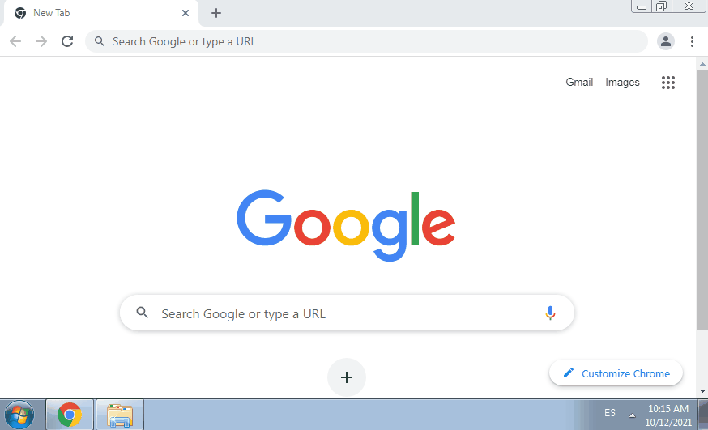
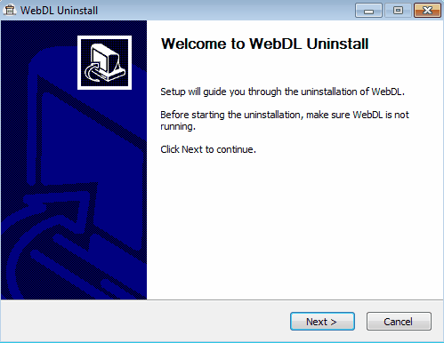

# WebDL

_Java desktop app - Custom protocol handler for downloading webpages in different formats_

[](WebDL_1.0.0-SNAPSHOT.exe)

---

## Features
**WebDL** is a Java desktop application built to download webpages in multiple formats through a custom protocol handler:
* **HTML**: Download the page as a HyperText Markup Language file.
* **PDF**: Download the page in PDF format.
* **Images**: Download all images of a specific web page.
* **Screenshot**: Take a full page screenshot.
* **Video**: Download the first video of a specific web page.
* **Markdown**: Download Wikipedia articles as markdown files.

## Requirements
* Operating System: Windows
* Google Chrome: for screenshot, video and pdf options.
* Internet connection

---

## Usage
### Installation
Execute the WebDL installer and follow the wizard along.


### Execution
Call any webpage URL of your choice using "webdl://" as protocol and then, append one of the following types as a query param with the name "type":
* HTML: downloads the page as HTML.
* PDF: downloads the page as PDF.
* IMG: downloads all the images of the page in a new folder.
* SS: takes a full page PNG screenshot.
* VID: downloads the first video of the page.
* MD: downloads Wikipedia articles as markdown.



#### Examples
| Type | Original URL | WebDL URL |
|----------|-------------|------|
| HTML | https://en.wikipedia.org/wiki/The_Byrds | webdl://en.wikipedia.org/wiki/The_Byrds?type=HTML |
| PDF | https://en.wikipedia.org/wiki/The_Byrds | webdl://en.wikipedia.org/wiki/The_Byrds?type=PDF |
| IMG | https://en.wikipedia.org/wiki/The_Byrds | webdl://en.wikipedia.org/wiki/The_Byrds?type=IMG |
| Screenshot | https://en.wikipedia.org/wiki/The_Byrds | webdl://en.wikipedia.org/wiki/The_Byrds?type=SS |
| Video | https://9gag.com/gag/a07mxVX | webdl://9gag.com/gag/a07mxVX?type=VID |
| Markdown | https://en.wikipedia.org/wiki/The_Byrds | webdl://en.wikipedia.org/wiki/The_Byrds?type=MD |

### Uninstallation
Execute the WebDL uninstaller and follow the wizard along.



### Configuration
By default, the web pages will be saved in the user's download directory. If you want to change this path, you can do so by modifying the configuration file "application.properties" located inside the WebDL installation directory.

The file contains the following configuration properties:
* **download.folder**: Folder where WebDL downloads will be stored.

---
## Technical aspects
WebDL uses the following dependencies to perform its functions:
* [**jsoup**](https://jsoup.org): Java HTML Parser. Used for HTML, MD, VID and IMG type downloads.
* [**Selenium**](https://www.selenium.dev): Project for automating web applications. Used with the Chrome driver for SS, VID and PDF type downloads.
* [**WebDriverManager**](https://github.com/bonigarcia/webdrivermanager): Java library that carries out the management of the drivers required by Selenium WebDriver. Used to manage Chrome driver download.
* [**Selenium Shutterbug**](https://github.com/assertthat/selenium-shutterbug): Java utility library for making screenshots using Selenium WebDriver. Used to take a full page screenshot in SS type downloads.

The installer is generated with a custom script written for [**NSIS**](https://nsis.sourceforge.io/Main_Page) that performs the following actions:
* Registers the custom protocol "webdl://" in the Windows registry.
* It embeds the 32 bit JRE of Java 1.8 to avoid its independent installation and allow the application to work on all windows systems, regardless of their SO architecture.
* Creates the installer and uninstaller with a visible UI using [MUI2](https://nsis.sourceforge.io/Docs/Modern%20UI%202/Readme.html)

To compile the installer, you need to run the following maven command: 
```
mvn clean install -P installer -Dnsis.path=${NSIS_PATH} -Djre.path=${JRE_PATH}
```

The application logs are stored in a new folder named *".webdl"* inside the user's directory.
